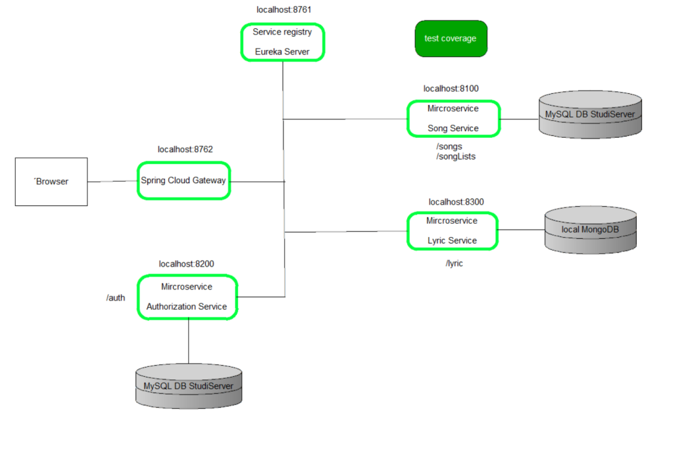

# microservices-song
Final project of the Course Component-based Development at the HTW Berlin

1. Eureka Server: The Eureka server is an implementation of service discovery pattern, where microservices can register themselves so others can discover them.
2. Spring Cloud Gateway: The Gateway offers the possibility to filter and forward all incoming requests.
3. Auth-Service: The Authorization Service is responsible for user authentication.
4. Microservice Song-Service: 

